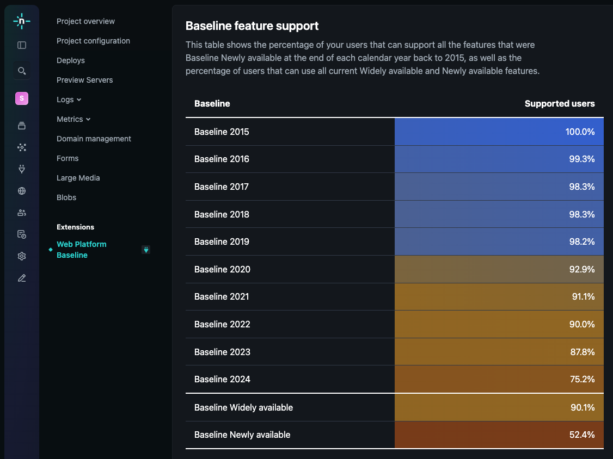

# Web Platform Baseline extension

[Baseline](https://developer.mozilla.org/en-US/docs/Glossary/Baseline/Compatibility) is an initiative from the [W3C WebDX Community Group](https://www.w3.org/community/webdx/).  Baseline categorieses web features and APIs that are fully supported across the most common browsers, making it easier for developers to build sites that work for their users and adopt new features safely.  Baseline availability appears on MDN docs and caniuse.com.  Baseline targets can be configured in a variety of linters and tools, either directly or using the [browserslist-config-baseline](https://web.dev/articles/use-baseline-with-browserslist) adapter module.

## What is this extension?

This extension helps you visualise which Baseline targets are available to your users.  You can use the visualisations to understand which Baseline target is suitable for you - whether it's Baseline Widely available or a Baseline year.

This extension uses a Netlify edge function which is triggered by all the requests that your site receives that are not for image, video, audio, font, script, or style resources. The edge function uses [UAParser.js](https://uaparser.dev/) to parse the user agent string and determine the browser and its version and filter out crawler agents. The data is stored in a Netlify blob with a 7-day window. The browser names and versions are matched to Baseline years and Widely available support status using data from the W3C WebDX Community Group's [baseline-browser-mapping](https://npmjs.com/baseline-browser-mapping) module.

## How to set up this extension

1. Install the extension by clicking the "Install" button above.
2. Go to the the "Sites" menu in the sidebar and select the site that you want to analyse.
3. Navigate to the "Web Platform Baseline" link under "Extensions".
4. Click on "Enable analytics and deploy site". This enables the edge function and creates an environment variable called `BASELINE_ANALYTICS` which is required for the edge function to capture data.
5. Wait for a few days to get a representative sample of your traffic.

> **NOTE:**  
> This extension uses edge functions and blobs to process and store data.  Depending on your volume of site traffic, this may have an impact on your service costs from Netlify.

## How to disable this extension

To disable this extension, click "Disable analytics and deploy site" then "Confirm" in the extension UI.  This will stop data capture and disable the charts UI.

## Debug options

If you need to submit a bug or want to check the underlying data for your site, use the debug options at the bottom of the extension UI:

- Show debug data: shows the underlying data for the extension UI as formatted JSON.  This can be useful if you want to submit a UI bug for this extension.
- Enable edge function logging: outputs data in Logs > Edge Functions that can be helpful in understanding how certain browser versions are classified.  Triggers a redeploy to ensure the change in environment variable is detected by the edge function.
- Delete all captured data permanently: Deletes all data in the blob store used by this extension permanently.  This action cannot be reversed.

## Feature requests, bugs and contributing

This extension is provided by members of the [W3C WebDX Community group](https://www.w3.org/community/webdx/).  If you would like to file a feature request or bug, please do so in the [public repository](https://github.com/tonypconway/netlify-baseline-extension).
